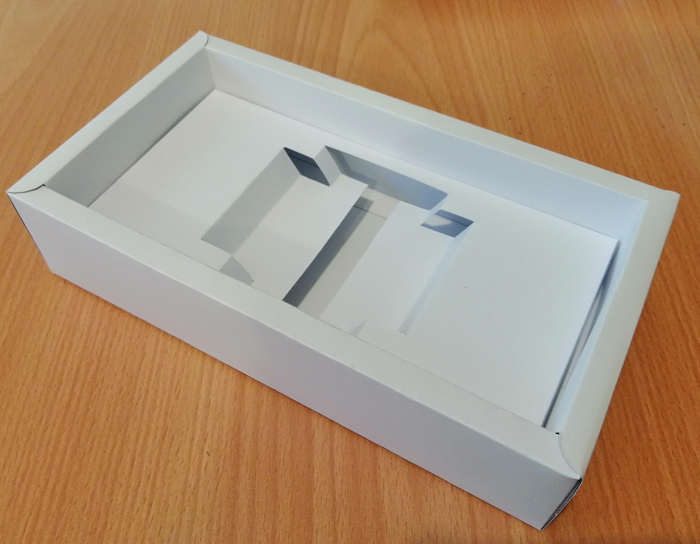
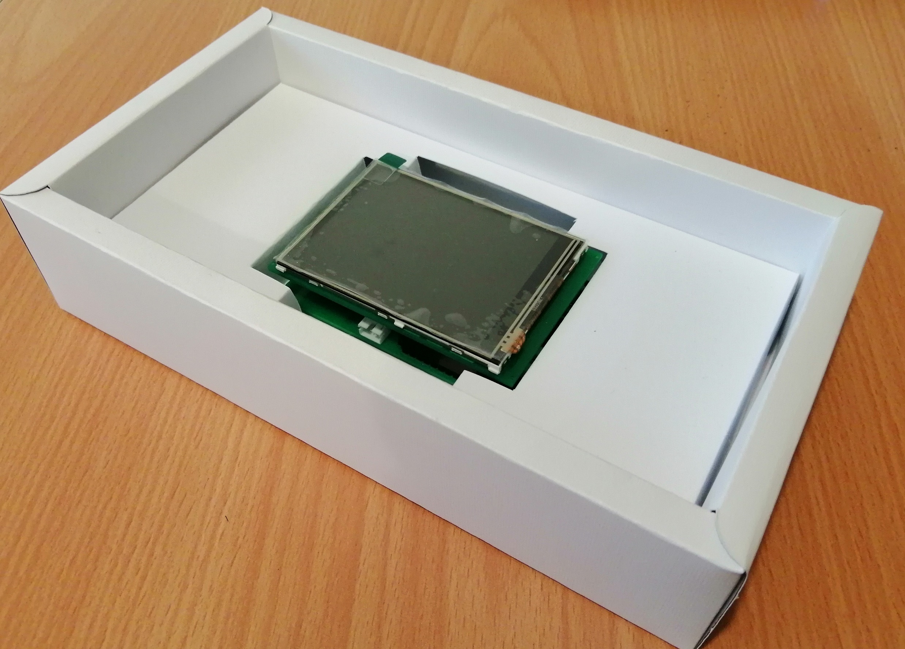

# Introduction

Idea of  box comes from [Arvinpack](https://www.arvinpack.com/product/craft-prepared-box-keshoyi/). 

Their box is not manufactured form proper material. So designed and built something similar to it. (from _Fabriano  paper, 220 g/m2, 50x70_)

## Files

As I'm an electronic engineer so I'd designed box files with **Altium Designer**!

- `box.PcbDoc`: contains box cutout (_Thick_ lines should be cut, _Thin_ lines should be bent)
- `cover.PcbDoc`: contains cover cutout 
- `holder.PcbDoc`: contains board holder cutout

For each one, I've created `pdf` files which must be printed in actual size (`A4` for holder, `A2` for box and cover)

