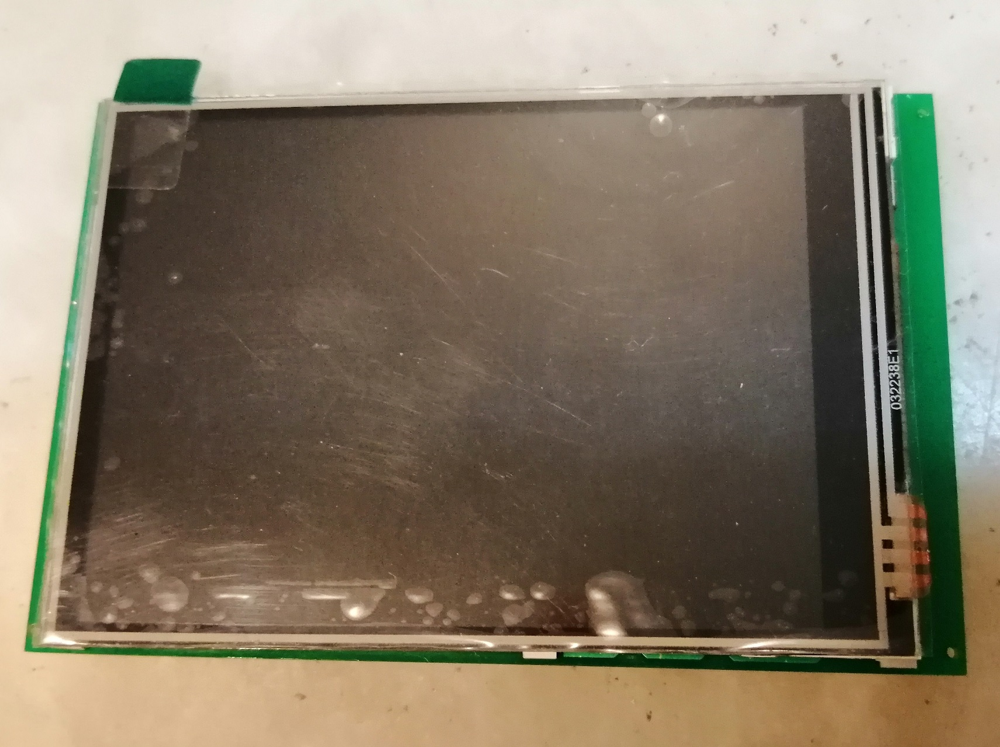
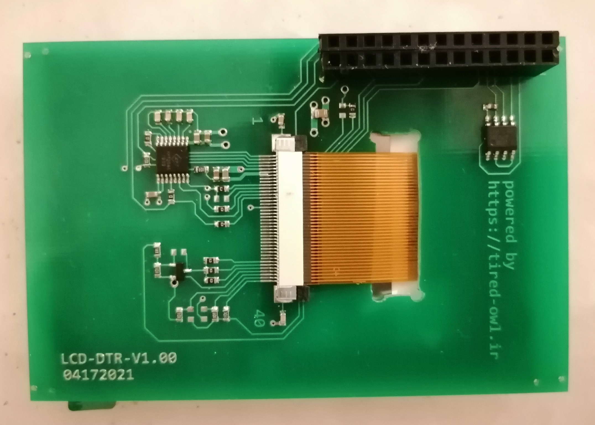

# Introduction

This folder contains SCH/PCB files for LCD daughter board 

This board contains following items 
- **40pin-FPC** connector which is compatible with following LCDs
  - *ZJY320IT008*: 3.2 inch *240x320* dots matrix TFT LCD module with `ili9341` controller
  - *ZJY350IT006*: 3.5 inch *320x480* dots matrix TFT LCD module with `ili9486` controller
- `xpt2046` touch screen controller (`ADS7843` can be used too)
- `AT24C512C-SSHD-T` eeprom for some permanent information 

# 3.5/3.2 inch LCD support

According to datasheets of *ZJY320IT008* and *ZJY350IT006* they are **NOT** exactly pin-to-pin compatible!
There is a **subtle** difference which is handled in SCH/PCB via `0R` options. 
For simplicity, I just document the difference. 

| Pin			| *ZJY320IT008* function 		| *ZJY350IT006* function 		|
|---------------|-------------------------------|-------------------------------|
| **10** 		| `SCK` (SPI) / `RS` (Parallel)	| `D/CX`(SPI)			 		|
| **11**		| `D/CX`(SPI) / `WR` (Parallel) | `SCK` (SPI) / `RS` (Parallel) |
| **38/39/40**	| `b011` 4-wire / 8-bit / SPI	| `b111` 4-wire SPI				|

This difference is handled via `R9`/`R17`/`R18`/`R19`/`R20`/`R21` in daughter

| Rx 	| *ZJY320IT008* | *ZJY350IT006* |
|-------|---------------|---------------|
| `R9`	|	`DNP`		|	`10K`		|
| `R17`	|	`10K`		|	`DNP`		|
| `R18`	|	`0R`		|	`DNP`		|
| `R19`	|	`DNP`		|	`0R`		|
| `R20`	|	`DNP`		|	`0R`		|
| `R21`	|	`0R`		|	`DNP`		|

For more information please check `DOC/datasheets/lcd`

# BOM

| Designator 							| 	Quantity	|	Value			|	Footprint	|
|---------------------------------------|---------------|-------------------|---------------|
| `C1`,`C2`,`C8`,`C9`,`C10`,`C11`,`C12`	|	**7**		| `100nF`			|	*0603*		|
| `C3`									|	**1**		| `10uF`			|	*0603*		|
| `C4`,`C5`,`C6`,`C7`					|	**4**		| `10nF`			|	*0603*		|
| `C13`									|	**1**		| `10uF`			|	*0805*		|
| `R1`,`R2`,`R7`,`R8`,`R13`,`R17`		|	**6**		| `10K` 			|	*0603*		|
| `R3`,`R4`,`R5`,`R6`,`R18`,`R21`		|	**6**		| `0R`				|	*0603*		|
| `R9`,`R12`							|	**2**		| `10K_DNP`			|	*0603*		|
| `R10`,`R19`,`R20`						|	**3**		| `0R_DNP`			|	*0603*		|
| `R11`									|	**1**		| `330R`			|	*0603*		|
| `R14`,`R15`,`R16`						|	**3**		| `10R`				|	*0603*		|
| `Q1`									|	**1**		| `IRLML2803TRPBF` 	|	*SOT23*		|
| `U1`									|	**1**		| `xpt2046`			| 	*TSSOP16*	|
| `U2`									|	**1**		| `AT24C512C-SSHD-T`|	*8S1_N*		|
| `LCD1`								|	**1**		| `FPC` 			| *40pin-0.5mm*	|
| `P1`									|	**1**		| `HDR2X13`			| *2x13 100mil*	|

