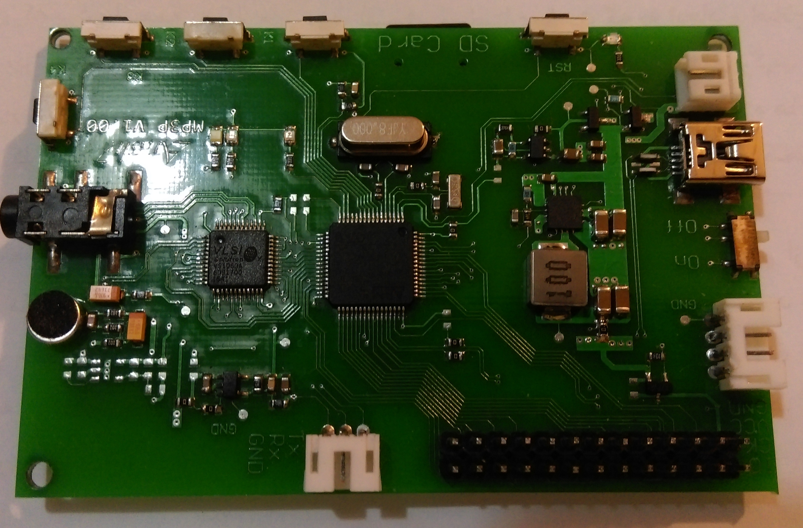
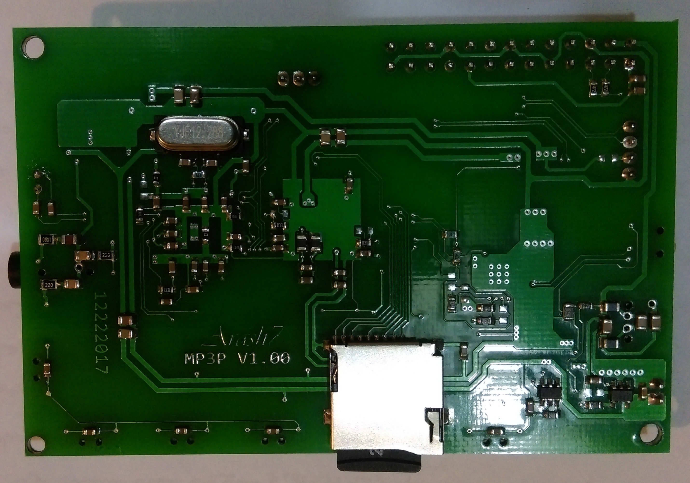

# Introduction

`VS1063` is an audio encoder/decoder from [VLSI solution](http://www.vlsi.fi/en/home.html). Base on VS1063 and STM32F1X, I'd designed a simple MP3 player. 

# Specification

Here is list of main element used in my MP3P project:

- VS1063 as MP3 / FLAC decoder
- STM32F103RCT6 as main controller 
- Can be powered from USB and Li-ion battery (without interruption on exchange)
- TP62110 as switching regulator (3v7 to 3v3)
- MAX1555 Li-ion battery charger
- LTC4214 Power Path controller 
- SDIO 4bit connection (<u>which only 1bit got working</u>!)
- Header pin for LCD connection

# Notes

Here is some important notes about this project

1. <u>There is an issue with SDIO and 4 bit connection</u>. I can **NOT** get 4 bit mode working. So I tried to deal with 1bit mode. The problem show it self when you are decoding **FLAC** format. because of SD card slow interface, music can get slow! 
2. I think I should use pull-ups in SDIO data pins. But I'm not sure and I didn't try it till now!
3. Codes is `FW` directory is simple demo application, which play everything in root directory of SD card.
4. Before any decision about this board, as good friend said: **Check it yourself** !
5. Finally ... Have fun ...

